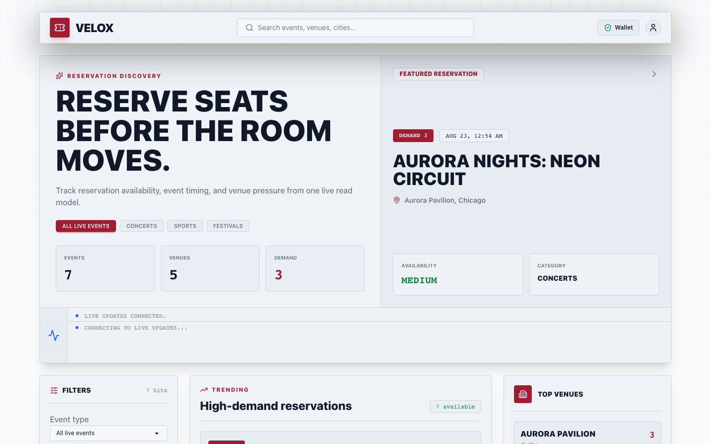
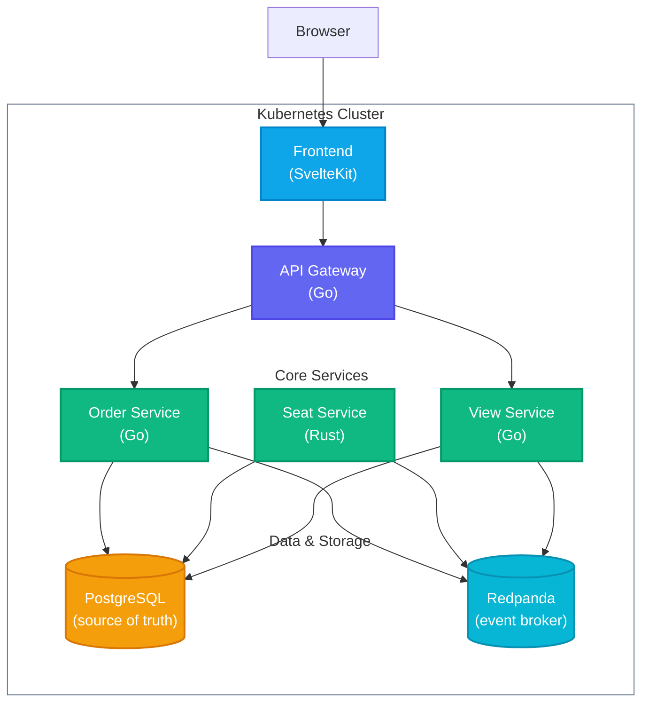
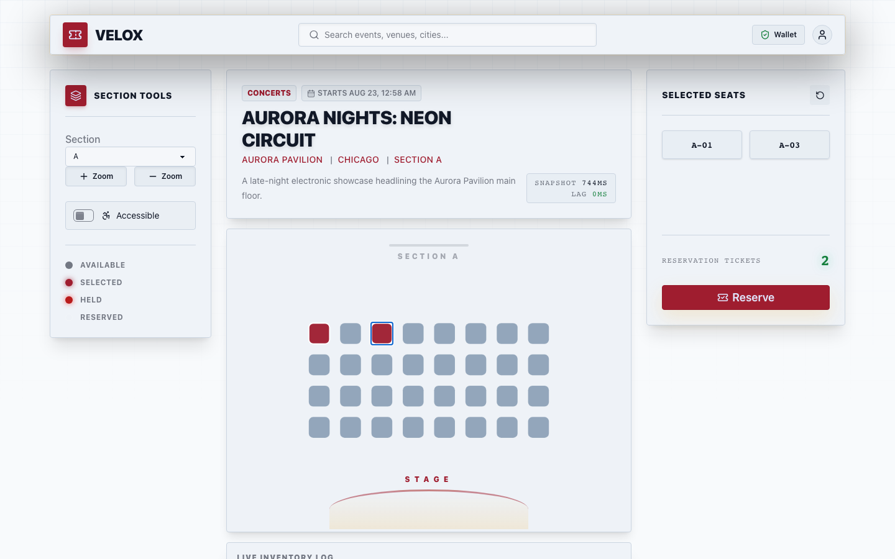
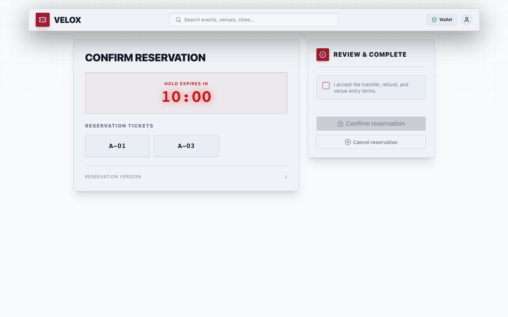
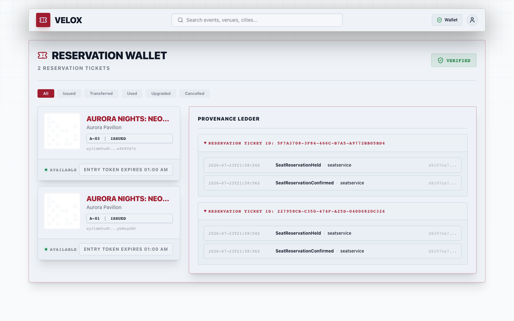
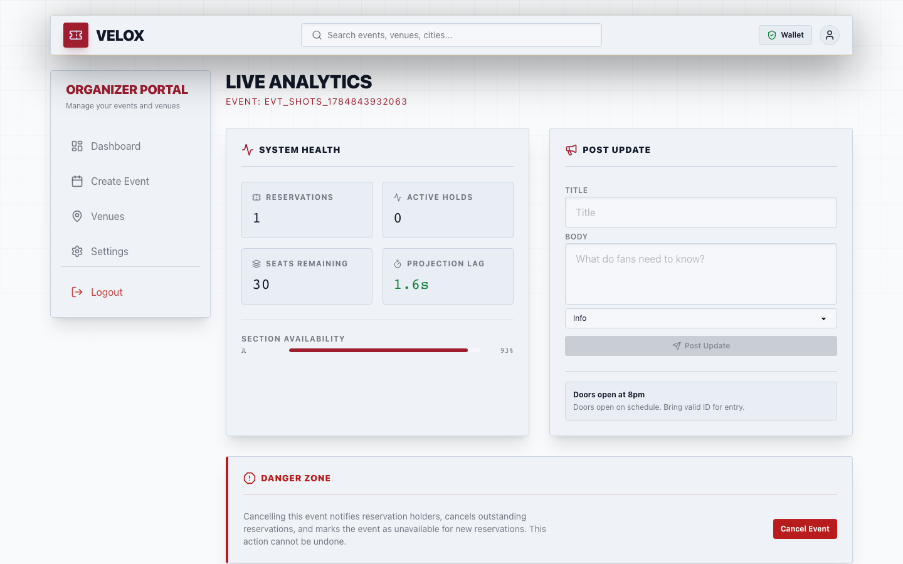
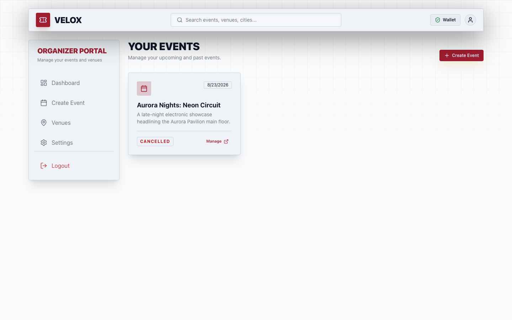

# Velox



**Velox** is a Kubernetes-first event reservation platform built for high
contention: many reservers competing for the same seats while organizers watch
live inventory and reservation state. It combines a SvelteKit SSR frontend with
Go and Rust backend services, PostgreSQL-owned stores, Redpanda-compatible
Kafka event flow, and Dragonfly-backed coordination.

## Features

- **Authentication & Roles**: Secure JWT-based login and registration flow with distinct `Reserver` and `Organizer` RBAC profiles.
- **Seat reservations**: Event discovery, interactive SVG seat maps with Server-Sent Events (SSE) live updates, a 10-minute lock countdown pipeline, and order history.
- **Organizer dashboard**: Role-protected portal for managing venues, staff, creating events via a multi-step wizard, and live analytics.
- **Virtual Waiting Room & Rate Limiting**: Token-bucket rate limiting via Dragonfly/Redis at the Go ingress, paired with a frontend virtual waiting room to gracefully handle `429 Too Many Requests` during peak reservation demand.
- **Idempotent commands**: Reservation requests require `Idempotency-Key`; duplicate matching requests return the original order while conflicting bodies are rejected.
- **Optimistic Concurrency**: Seat double-booking is prevented using Sequence Version Numbers (`VersionMismatch`) in the Rust Event Store, avoiding slow SQL table locks.
- **Compensating Sagas**: Order lifecycle changes (explicit cancellation via `OrderCancelled`, or a hold timing out in `seatservice`'s own expiry sweep) trigger Kafka-choreographed compensating transactions (`SeatReservationExpired`) to instantly free up inventory.
- **Immutable Ledger**: User ticket wallets show a provenance ledger built from backend event-sourcing streams.
- **Kubernetes runtime**: Manifests and `scripts/deploy.sh` build images, create development secrets, apply resources, wait for rollouts, and port-forward the frontend.

## Architecture



| Service                           | Language   | Description                                                                                                  |
| --------------------------------- | ---------- | ------------------------------------------------------------------------------------------------------------ |
| [frontend](apps/frontend)         | TypeScript | SvelteKit SSR reservation and organizer UI with Tailwind v4, DaisyUI 5, Lucide icons, and live seat state. |
| [apigateway](apps/apigateway)     | Go         | Public HTTP API, dev login, JWT session cookies, role checks, request bounds, and reservation orchestration. |
| [orderservice](apps/orderservice) | Go         | Order state, idempotency, reservation confirmation, and transactional outbox behavior.                       |
| [seatservice](apps/seatservice)   | Rust       | Seat stream concurrency rules, version checks, hold expiry, and ticket issuing rules.                        |
| [viewservice](apps/viewservice)   | Go         | Idempotent projection helpers for read models and organizer-facing state.                                    |
| [database](apps/database)         | PostgreSQL | Versioned schema migrations and local seed data for service-owned schemas.                                   |

## Infrastructure

Four in-cluster stateful dependencies support the local runtime:

- **PostgreSQL** — One local instance with isolated logical schemas for orders,
  inventory, and projections.
- **Redpanda** — Kafka-compatible broker for order and inventory events.
- **Dragonfly** — Redis-protocol cache intended for rate limits, hot
  coordination, and fanout state.
- **Kubernetes** — First supported runtime via `kind` or any active cluster
  context.

## Docs

Architectural specs live in [`docs/`](docs/):

| Doc                                         | Contents                                                                         |
| ------------------------------------------- | -------------------------------------------------------------------------------- |
| [api.md](docs/api.md)                       | Public, reserver, organizer, auth, and internal route contracts                  |
| [architecture.md](docs/architecture.md)     | Service topology, event choreography, consistency model, and security boundaries |
| [business-rules.md](docs/business-rules.md) | Roles, reservations, event lifecycle, wallet, and rate-limit rules              |
| [data-model.md](docs/data-model.md)         | Logical schemas, table ownership, constraints, indexes, and model gaps           |
| [deployment.md](docs/deployment.md)         | Kubernetes local runtime, generated secrets, port-forwarding, and smoke checks   |
| [design-system.md](docs/design-system.md)   | Visual tokens, layout rules, seat states, and UI state patterns                  |
| [frontend.md](docs/frontend.md)             | Reserver and organizer route map, UI behavior, live updates, and accessibility   |
| [infrastructure.md](docs/infrastructure.md) | Kafka failure modes, reservation expiry, cache behavior, and backpressure        |
| [security.md](docs/security.md)             | Session, request, token, event-signing, header, and logging controls             |

## Deploy

Deploy Velox to the active Kubernetes context:

```sh
./scripts/deploy.sh
```

The script builds images, creates or updates generated development secrets,
applies manifests from `deploy/`, waits for rollouts, and starts a frontend port-forward:

- Frontend: http://velox.localhost:8080 by default, configurable with `LOCAL_FRONTEND_PORT`

Images build and push to `localhost:5000/velox-<service>:<content-checksum>` by
default. Override the registry or force one shared tag when needed:

```sh
IMAGE_PREFIX=localhost:5001/velox GIT_SHA=dev ./scripts/deploy.sh
```

## Try It

Once the frontend port-forward is up, exercise both roles from the browser.

Buyer flow:

- Register or log in as a `reserver` at `/register` or `/login`.
- Browse and filter events at `/events`, then open one to view its live seat
  map at `/events/{eventId}`.
- Select up to 8 seats and reserve them; the 10-minute hold countdown carries
  into `/reservation`.

  

- Confirm the reservation before the hold expires.

  

- Check the issued ticket and its provenance ledger at `/wallet`.

  

Organizer flow:

- Register or log in as an `organizer`.
- Create a venue at `/organizer/venues/new`, then create an event for it
  through the wizard at `/organizer/events/new`.
- Open `/organizer/events/{eventId}/dashboard` for live inventory, metrics,
  and announcement posting.

  

- Cancel the event from the same dashboard to see outstanding orders
  bulk-cancel and any issued wallet tickets for that event flip to
  `CANCELLED`.

  

## Local-Runtime Boundaries

This deployment targets a single local Kubernetes context, not production:

- **No TLS**: frontend and gateway both serve plain HTTP and omit
  `Strict-Transport-Security`/`upgrade-insecure-requests`, since the
  documented local runtime is reached over `kubectl port-forward`.
- **Reservation-only checkout**: confirming a hold issues a reservation
  ticket directly; there is no payment processor, processor form, or
  transaction copy in the product.
- **Locally generated secrets**: `scripts/deploy.sh` creates or updates
  development secrets for local use; production-like clusters must supply
  managed secrets with the same names instead.

See [security.md](docs/security.md) and [deployment.md](docs/deployment.md)
for the full detail behind these constraints.

## Cleanup

Remove deployed resources and the namespace:

```sh
kubectl delete -f ./deploy -n velox
kubectl delete namespace velox
```

## Testing

Run the local checks:

```sh
make lint
make test
make build
make smoke
```

After deploying, `scripts/failure-drill.sh` restarts the PostgreSQL, cache,
and broker workloads and confirms the application deployments recover.

PostgreSQL integration tests are opt-in:

```sh
VELOX_TEST_DATABASE_URL='user=velox password=velox host=localhost port=5432 dbname=velox sslmode=disable' go test ./apps/apigateway/internal
```

## License

Licensed under the [MIT](LICENSE) License.
