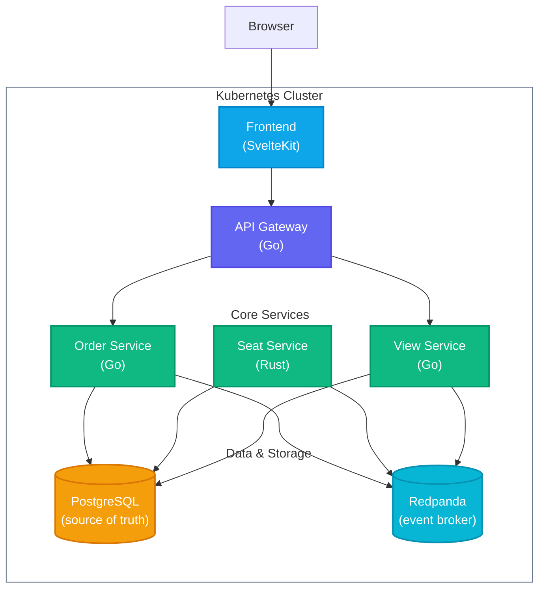

# Velox

**Velox** is a Kubernetes-first event ticket marketplace MVP built for
flash-sale contention: many buyers competing for the same reserved seats while
vendors watch live inventory and order state. It combines a SvelteKit SSR
frontend with Go and Rust backend services, PostgreSQL-owned stores,
Redpanda-compatible Kafka event flow, and Dragonfly-backed coordination.

## Features

- **Authentication & Roles**: Secure JWT-based login and registration flow with distinct `Customer` and `Vendor` RBAC profiles.
- **Seat reservations**: Event discovery, interactive SVG seat maps with Server-Sent Events (SSE) live updates, a 10-minute lock countdown pipeline, and order history.
- **Vendor dashboard**: Role-protected portal for managing venues, staff, creating events via a multi-step wizard, and live analytics.
- **Virtual Waiting Room & Rate Limiting**: Token-bucket rate limiting via Dragonfly/Redis at the Go ingress, paired with a frontend virtual waiting room to gracefully handle `429 Too Many Requests` during flash sales.
- **Idempotent commands**: Reservation requests require `Idempotency-Key`; duplicate matching requests return the original order while conflicting bodies are rejected.
- **Optimistic Concurrency**: Seat double-booking is prevented using Sequence Version Numbers (`VersionMismatch`) in the Rust Event Store, avoiding slow SQL table locks.
- **Compensating Sagas**: Order lifecycle changes (explicit cancellation via `OrderCancelled`, or a hold timing out in `seatservice`'s own expiry sweep) trigger Kafka-choreographed compensating transactions (`SeatReservationExpired`) to instantly free up inventory.
- **Immutable Ledger**: User ticket wallets showcase a provenence ledger built directly from the backend's Event Sourcing streams.
- **Kubernetes runtime**: Manifests and `scripts/deploy.sh` build images, create development secrets, apply resources, wait for rollouts, and port-forward the frontend and gateway.

## Architecture



| Service                           | Language   | Description                                                                                                  |
| --------------------------------- | ---------- | ------------------------------------------------------------------------------------------------------------ |
| [frontend](apps/frontend)         | TypeScript | SvelteKit SSR reserver and vendor UI with Tailwind, DaisyUI, Lucide icons, live seat state, and checkout.    |
| [apigateway](apps/apigateway)     | Go         | Public HTTP API, dev login, JWT session cookies, role checks, request bounds, and reservation orchestration. |
| [orderservice](apps/orderservice) | Go         | Order state, idempotency, reservation confirmation, and transactional outbox behavior.                       |
| [seatservice](apps/seatservice)   | Rust       | Seat stream concurrency rules, version checks, hold expiry, and ticket issuing rules.                        |
| [viewservice](apps/viewservice)   | Go         | Idempotent projection helpers for read models and vendor-facing state.                                       |
| [database](apps/database)         | PostgreSQL | Versioned schema migrations and demo seed data for service-owned schemas.                                    |

## Infrastructure

Four in-cluster stateful dependencies support the MVP:

- **PostgreSQL** — One local instance with isolated logical schemas for orders,
  inventory, and projections.
- **Redpanda** — Kafka-compatible broker for order and inventory events.
- **Dragonfly** — Redis-protocol cache intended for rate limits, hot
  coordination, and fanout state.
- **Kubernetes** — First supported runtime via `kind` or any active cluster
  context.

## Docs

Architectural specs live in [`docs/`](docs/):

| Doc                                         | Contents                                                                         |
| ------------------------------------------- | -------------------------------------------------------------------------------- |
| [architecture.md](docs/architecture.md)     | Service topology, event choreography, consistency model, and security boundaries |
| [deployment.md](docs/deployment.md)         | Kubernetes local runtime, generated secrets, port-forwarding, and smoke checks   |
| [frontend.md](docs/frontend.md)             | Buyer and vendor route map, UI behavior, live updates, and accessibility         |
| [infrastructure.md](docs/infrastructure.md) | Kafka failure modes, reservation expiry, cache behavior, and backpressure        |

## Deploy

Deploy Velox to the active Kubernetes context:

```sh
./scripts/deploy.sh
```

The script builds images, creates or updates generated development secrets,
applies manifests from `deploy/`, waits for rollouts, and starts port-forwards:

- Frontend: http://localhost:8080
- Gateway: http://localhost:8081

Images build and push to `localhost:5000/velox-<service>:<git-sha>` by default.
Override the registry or commit tag when needed:

```sh
IMAGE_PREFIX=localhost:5001/velox GIT_SHA=dev ./scripts/deploy.sh
```

## Cleanup

Remove deployed resources and the namespace:

```sh
kubectl delete -f ./deploy -n velox
kubectl delete namespace velox
```

## Testing

Run the local checks:

```sh
make lint
make test
make build
```

PostgreSQL integration tests are opt-in:

```sh
VELOX_TEST_DATABASE_URL='user=velox password=velox host=localhost port=5432 dbname=velox sslmode=disable' go test ./apps/apigateway/internal
```

## License

Licensed under the [MIT](LICENSE) License.
